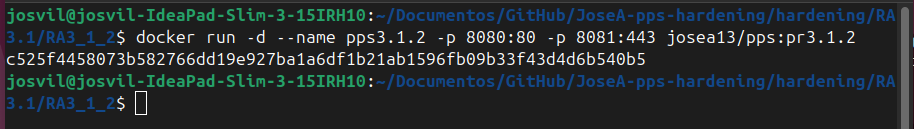
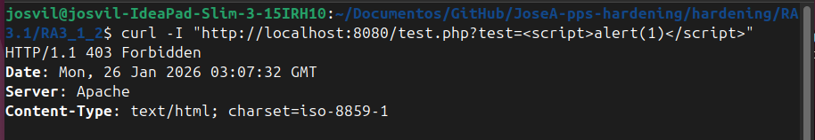

# Implementación de WAF ModSecurity (RA3.1.2)

**Autor:** Jose Alonso Villanova

**Imagen Docker Hub:** Josea13/pps:pr3.1.2

```markdown
**Comando para descargar la imagen:**
`docker pull josea13/pps:pr3.1.2`
```

## Introducción

En esta fase se ha integrado un Web Application Firewall (WAF) mediante el módulo ModSecurity. A diferencia del bastionado básico, el WAF proporciona una capa de defensa activa que inspecciona el tráfico HTTP en tiempo real para bloquear ataques dirigidos a la capa de aplicación.

## Configuración Técnica

Para la activación del firewall, se han realizado las siguientes acciones en el contenedor:

- Instalación: Inclusión de libapache2-mod-security2 y el motor de PHP.

- Activación del motor: Se ha modificado la directiva SecRuleEngine de DetectionOnly a On en el archivo /etc/modsecurity/modsecurity.conf.

- Reglas: Uso del conjunto de reglas recomendadas por el Core Rule Set (CRS) para la detección de anomalías.

##  Infraestructura y Despliegue

Construcción de la imagen basada en el endurecimiento previo (3.1.1) e integración del firewall:
```Bash
docker run -d --name pps3.1.2 -p 8080:80 -p 8081:443 josea13/pps:pr3.1.2
```


##  Verificación del WAF (Prueba de Inyección)

Se ha validado la eficacia del firewall simulando un ataque de Cross-Site Scripting (XSS).
```Bash
curl -I "http://localhost:8080/test.php?test=<script>alert(1)</script>"
```

Resultado obtenido:



##  Conclusiones

El WAF ModSecurity bloquea peticiones maliciosas y protege la aplicación frente a inyecciones XSS, asegurando la integridad de los scripts PHP.
