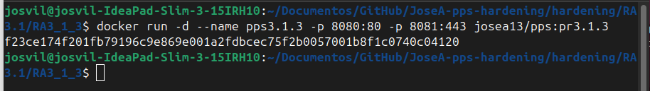
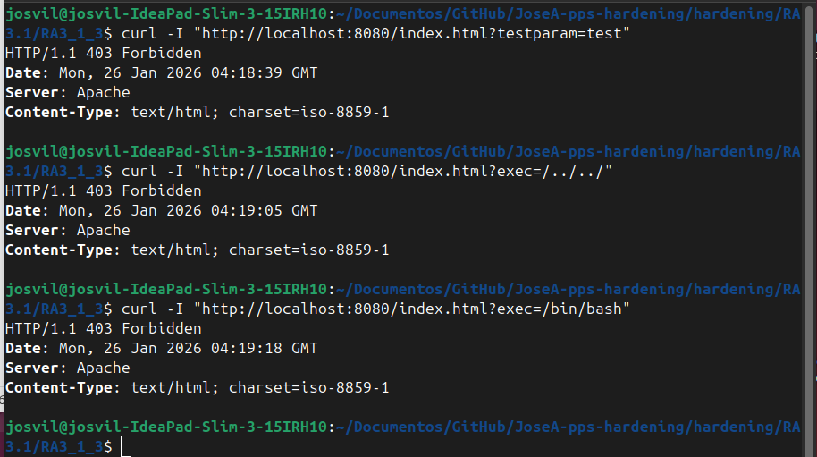
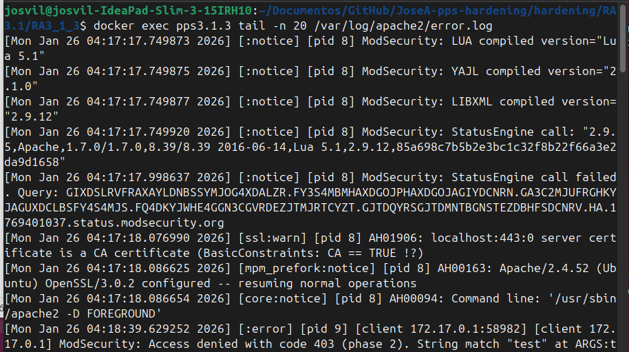

# Implementación de OWASP Core Rule Set (RA3.1.3)

**Autor:** Jose Alonso Villanova

**Imagen Docker Hub:** josea13/pps:pr3.1.3

```markdown
**Comando para descargar la imagen:**
`docker pull josea13/pps:pr3.1.3`
```


## Introducción

En esta fase avanzada, se ha integrado el conjunto de reglas OWASP Core Rule Set (CRS) en ModSecurity. A diferencia de las reglas manuales, el CRS proporciona una base de datos de firmas que protege al servidor contra las vulnerabilidades más críticas del "Top 10 de OWASP", incluyendo inyecciones, ataques de protocolo y ejecución de código remoto.

## Configuración y Despliegue

La imagen se ha construido automatizando la descarga y despliegue de las reglas oficiales:

- **Origen de reglas:** Clonación del repositorio oficial de SpiderLabs.

- **Integración:** Configuración del archivo security2.conf para cargar dinámicamente el núcleo de reglas (crs-setup.conf) y todas las reglas específicas de ataque (rules/*.conf).

- **Regla personalizada:** Se ha inyectado una directiva específica dentro del VirtualHost para pruebas internas de ciberseguridad.

```Bash
docker run -d --name pps3.1.3 -p 8080:80 -p 8081:443 josea13/pps:pr3.1.3
```



##  Verificación de Seguridad (Evidencias)
### Prueba de Regla Personalizada

Validación de la regla manual con ID 1234.

```Bash
    curl -I "http://localhost:8080/index.html?testparam=test"
```


##  Bloqueo de Ataques Genéricos (OWASP CRS)

Se han simulado dos ataques comunes que son interceptados automáticamente por las reglas de OWASP:




##  Análisis de Auditoría (Logs de ModSecurity)

La prueba definitiva de funcionamiento se encuentra en los logs de error de Apache, donde ModSecurity detalla la severidad y el ID de la regla activada.
```Bash
docker exec pps3.1.3 tail -n 20 /var/log/apache2/error.log
```



##  Conclusiones

La implementación de OWASP CRS transforma el servidor de un sistema pasivo a uno proactivo. La capacidad de analizar el Anomaly Score (puntuación de anomalía) permite bloquear peticiones que, aunque parezcan legítimas, contienen patrones maliciosos complejos, elevando significativamente el nivel de hardening del servicio.
