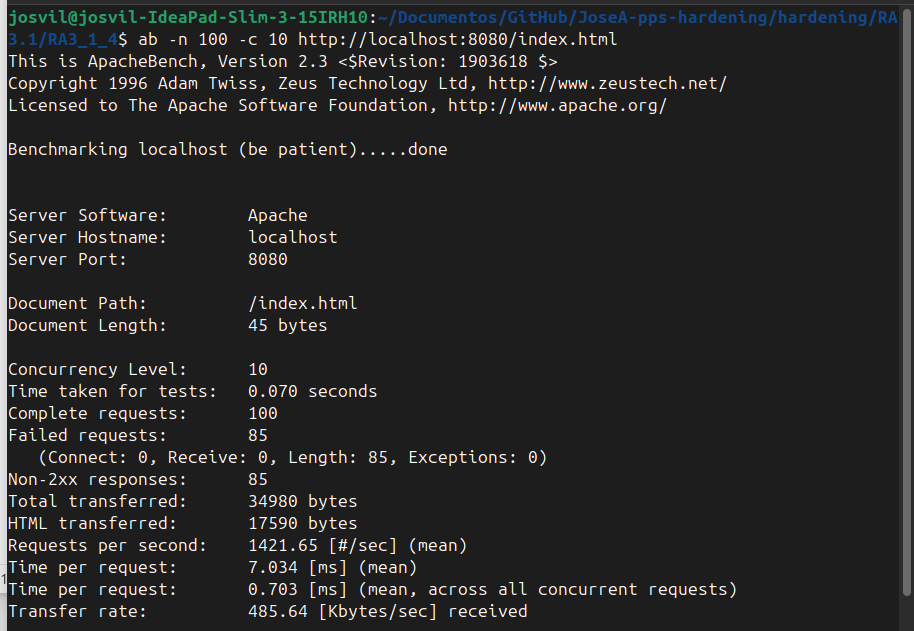

# Prevención de Ataques DoS con Mod_Evasive (RA3.1.4)

**Autor:** Jose Alonso Villanova

**Imagen Docker Hub:** josea13/pps:pr3.1.4

```markdown
**Comando para descargar la imagen:**
`docker pull josea13/pps:pr3.1.4`
```


## Introducción

En esta práctica se ha implementado el módulo mod_evasive para proteger el servidor Apache contra ataques de denegación de servicio (DoS) y ataques de fuerza bruta. El módulo monitorea las IPs entrantes y bloquea temporalmente aquellas que superan los umbrales de peticiones definidos.

## Configuración Técnica

Se ha aplicado una configuración restrictiva en el archivo evasive.conf para garantizar la detección inmediata durante las pruebas:

- DOSPageCount 2: Bloquea la IP si solicita la misma página más de 2 veces por segundo.

- DOSBlockingPeriod 10: El baneo temporal dura 10 segundos.

- DOSLogDir: Se ha creado y configurado el directorio /var/log/mod_evasive con los permisos adecuados (www-data) para registrar los bloqueos.


## Infraestructura y Despliegue

Primeramente se levanta el contenedor con la configuracion

```Bash
docker run -d --name pps3.1.4 -p 8080:80 -p 8081:443 josea13/pps:pr3.1.4
```
##  Verificación de Seguridad (Evidencia)

Para validar el funcionamiento, se ha utilizado la herramienta de estrés Apache Bench (ab), simulando una carga de 100 peticiones concurrentes.

Comando ejecutado:
```Bash
ab -n 100 -c 10 http://localhost:8080/index.html
```

Resultados del Informe:

- Peticiones totales: 100

- Peticiones fallidas (Bloqueadas): 85

- Non-2xx responses: 85 (Código 403 Forbidden enviado por el WAF/Evasive).



## Conclusiones

El módulo mod_evasive añade una capa de protección crítica al nivel de red/transporte. Los resultados demuestran que, ante un intento de saturación, el servidor responde denegando el acceso a la fuente sospechosa, preservando la disponibilidad de los recursos para usuarios legítimos.
