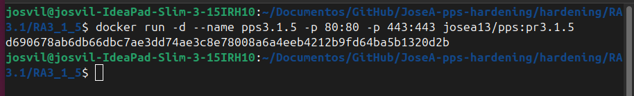
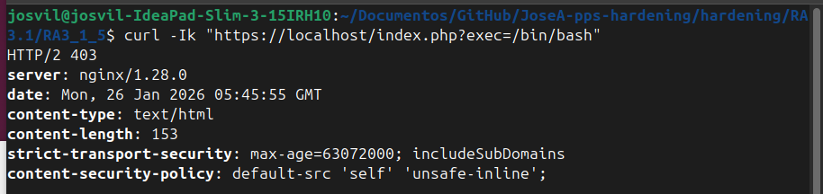

# Hardening de Servidor Web Nginx con WAF (RA3.1.5)

**Autor:** Jose Alonso Villanova

**Imagen Docker Hub:** josea13/pps:pr3.1.5

```markdown
**Comando para descargar la imagen:**
`docker pull josea13/pps:pr3.1.5`
```

## Introducción

Este proyecto implementa un despliegue securizado de Nginx utilizando la imagen base de OWASP ModSecurity CRS. Se ha configurado un WAF (Web Application Firewall) para interceptar ataques en tiempo real y se han aplicado directivas de endurecimiento para proteger un entorno con soporte PHP-FPM.
Medidas de Seguridad Implementadas

- **Implementación de WAF (ModSecurity v3):** Configuración del motor de reglas de OWASP en modo bloqueo para interceptar inyecciones, ataques de ejecución remota y escaneos de vulnerabilidades.

- **Implementación de HSTS:** Configuración de la cabecera Strict-Transport-Security para forzar el uso de conexiones seguras.

- **Configuración de CSP (Content Security Policy):** Establecimiento de una política que restringe la carga de recursos solo al origen local, mitigando ataques de tipo XSS.

- **Cifrado SSL/TLS:** Uso de certificados digitales para asegurar el tráfico mediante el puerto 443.

- **Control de Acceso (Basic Auth):** Restricción de acceso al directorio /protegido mediante credenciales cifradas con htpasswd.

## Infraestructura y Despliegue

Para este despliegue se utiliza la imagen oficial de ModSecurity adaptada con PHP-FPM, mapeando los puertos 80 y 443.
```Bash
docker run -d --name pps3.1.5 -p 80:8080 -p 443:8443 -e DETECTION_ONLY=0 josea13/pps:pr3.1.5
```


## Verificación de Medidas (Evidencias)
### Bloqueo de Ataques (WAF ModSecurity)

Validación de la interceptación de un ataque de ejecución de comandos mediante una petición maliciosa. El servidor debe responder con un código 403.
```Bash
curl -Ik "https://localhost/index.php?exec=/bin/bash"
```

### Análisis de Cabeceras de Seguridad (HSTS y CSP)

Verificación de que Nginx entrega correctamente las cabeceras de endurecimiento configuradas.
```Bash
curl -kI https://localhost
```

### Validación de PHP e Interfaz Segura

Acceso al servicio para verificar que el backend PHP-FPM responde correctamente bajo la protección del WAF y el cifrado SSL.

## Conclusiones

La integración de un WAF como ModSecurity junto con políticas de cabeceras estrictas permite elevar el nivel de seguridad de Nginx de una capa pasiva (configuración) a una capa activa de detección y respuesta ante incidentes.

