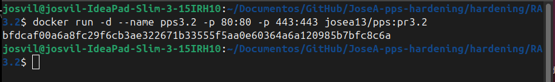
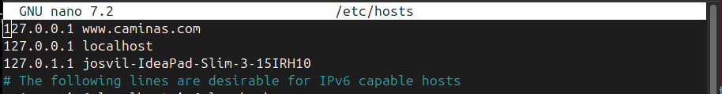
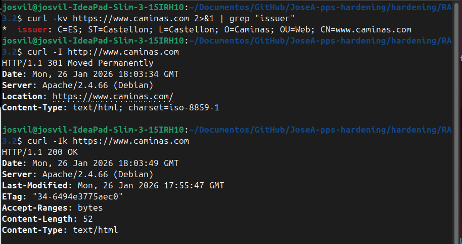

# Instalación de Certificado Digital en Apache (RA3.2)

**Autor:** Jose Alonso Villanova

**Imagen Docker Hub:** josea13/pps:pr3.2

```markdown
**Comando para descargar la imagen:**
`docker pull josea13/pps:pr3.2`
```


## Introducción

Este proyecto implementa la instalación y configuración de un certificado SSL/TLS auto-firmado en un servidor Apache sobre Debian. El objetivo es asegurar la confidencialidad de las comunicaciones mediante el cifrado del tráfico y la implementación de una redirección automática del protocolo HTTP al seguro (HTTPS).

## Medidas de Seguridad Implementadas

- **Activación de Mod_SSL:** Habilitación del módulo de Apache necesario para el soporte de criptografía SSL/TLS.

- **Generación de Certificado RSA:** Creación de un par de claves (pública/privada) de 2048 bits con validez de 365 días, personalizada para el dominio www.caminas.com.

- **Cifrado de Tráfico:** Configuración de las directivas SSLEngine, SSLCertificateFile y SSLCertificateKeyFile para proteger el VirtualHost del puerto 443.

- **Redirección Permanente (HTTP 301):** Configuración de un VirtualHost en el puerto 80 que redirige automáticamente cualquier petición no segura a la versión cifrada del sitio.

## Infraestructura y Despliegue

Se utiliza un contenedor Docker para aislar el servicio, mapeando los puertos estándar de red. Es necesario haber configurado el archivo local /etc/hosts para resolver www.caminas.com a 127.0.0.1.
```Bash
docker run -d --name pps3.2 -p 80:80 -p 443:443 josea13/pps:pr3.2
```


**IMPORTANTE**
Para que el dominio se resuelva correctamente hacia el contenedor, se debe añadir la siguiente linea al archivo `/etc/hosts`

```
127.0.0.1 www.caminas.com
```


## Verificación de Medidas (Evidencias)

### Validación del Certificado (Issuer)

Comprobación de que el certificado servido coincide con los datos introducidos durante la generación en el Dockerfile.
```Bash
curl -kv https://www.caminas.com 2>&1 | grep "issuer"
```

### Prueba de Redirección Automática

Verificación de que el servidor responde con un código de estado 301 al acceder por el puerto 80, redirigiendo a la URI segura.
```Bash
curl -I http://www.caminas.com
```

### Validación del Protocolo Seguro (SSL/TLS)

Acceso al servicio mediante HTTPS para verificar que el contenido se entrega correctamente bajo el protocolo seguro.
```Bash
curl -Ik https://www.caminas.com
```


## Conclusiones

La implementación de certificados digitales, incluso auto-firmados en entornos de prueba, es un paso fundamental en el endurecimiento de servidores para evitar ataques de interceptación de datos (Man-in-the-Middle) y garantizar la integridad de la información.

