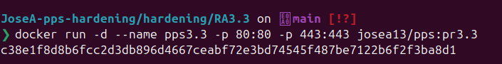
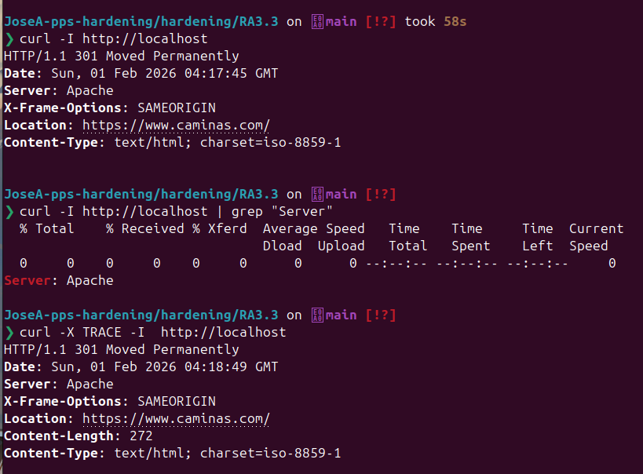

# Apache Hardening Best Practices (RA3.3)

**Autor:** Jose Alonso Villanova

**Imagen Docker Hub:** josea13/pps:pr3.3


```markdown
**Comando para descargar la imagen:**
`docker pull josea13/pps:pr3.3`
```


## Introducción

Este proyecto implementa las mejores prácticas de endurecimiento (hardening) en un servidor Apache sobre Debian, siguiendo las recomendaciones de seguridad de la guía de Geekflare. El objetivo es minimizar la exposición de información del sistema y cerrar vectores de ataque comunes mediante la reconfiguración de directivas por defecto.

## Medidas de Seguridad Implementadas

- **Minimización de Banner (Information Leakage):** Uso de ServerTokens Prod y ServerSignature Off para ocultar la versión de Apache y del Sistema Operativo.

- **Desactivación de Métodos Inseguros:** Bloqueo del método TRACE para prevenir ataques de Cross-Site Tracing (XST).

- **Hardening de Cabeceras HTTP:** Implementación de cabeceras de seguridad activas:

	- **X-Frame-Options:** Previene ataques de Clickjacking.

        - **X-XSS-Protection:** Activa el filtro contra scripts maliciosos.

        - **X-Content-Type-Options:** Evita que el navegador adivine el tipo MIME (MIME Sniffing).

- **Restricción de Métodos:** Uso de LimitExcept para permitir únicamente los métodos esenciales (GET, POST, HEAD).

- **Control de DoS Lento:** Reducción del Timeout a 60 segundos para mitigar ataques de tipo Slowloris.

## Infraestructura y Despliegue

El despliegue se realiza mediante un contenedor Docker que carga un archivo de configuración de seguridad personalizado (hardening.conf).
```Bash
docker run -d --name pps3.3 -p 80:80 -p 443:443 josea13/pps:pr3.3
```

## Verificación de Medidas (Evidencias)

### Ocultación del Banner del Servidor

Al realizar una petición, el servidor ya no revela que estamos usando Debian ni la versión específica de Apache.
```Bash
curl -I http://localhost | grep "Server"
```

### Bloqueo del Método TRACE

Se verifica que el método TRACE no está permitido, devolviendo un error 405.
```Bash
curl -X TRACE -Ik http://localhost
```
### Verificación de Cabeceras de Seguridad

Comprobamos que el servidor inyecta correctamente las cabeceras de protección configuradas.
```Bash
curl -I http://localhost
```

## Conclusiones

Mediante la aplicación de estas directivas de seguridad, se ha logrado transformar una instalación de Apache por defecto en un servicio endurecido que dificulta las fases de reconocimiento de un atacante y protege proactivamente a los usuarios finales.
